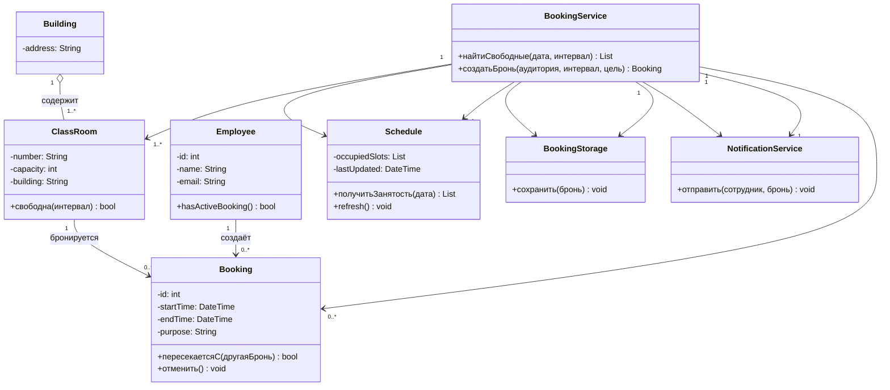

# isrp-lab6

```mermaid
classDiagram
    class Building {
        -address: String
    }
    class ClassRoom {
        -number: String
        -capacity: int
        -building: String
        +свободна(интервал) bool
    }
    class Booking {
        -id: int
        -startTime: DateTime
        -endTime: DateTime
        -purpose: String
        +пересекаетсяС(другаяБронь) bool
        +отменить() void
    }
    class Employee {
        -id: int
        -name: String
        -email: String
        +hasActiveBooking() bool
    }
    class Schedule {
        -occupiedSlots: List
        -lastUpdated: DateTime
        +получитьЗанятость(дата) List
        +refresh() void
    }
    class BookingService {
        +найтиСвободные(дата, интервал) List
        +создатьБронь(аудитория, интервал, цель) Booking
    }
    class BookingStorage {
        +сохранить(бронь) void
    }
    class NotificationService {
        +отправить(сотрудник, бронь) void
    }
    Building "1" o-- "1..*" ClassRoom : содержит
    ClassRoom "1" --> "0..*" Booking : бронируется
    Employee "1" --> "0..*" Booking : создаёт
    BookingService --> Schedule
    BookingService --> BookingStorage
    BookingService --> NotificationService
    BookingService "1" --> "1" Schedule
    BookingService "1" --> "1" BookingStorage
    BookingService "1" --> "1" NotificationService
    BookingService "1" --> "1..*" ClassRoom
    BookingService "1" --> "0..*" Booking
```